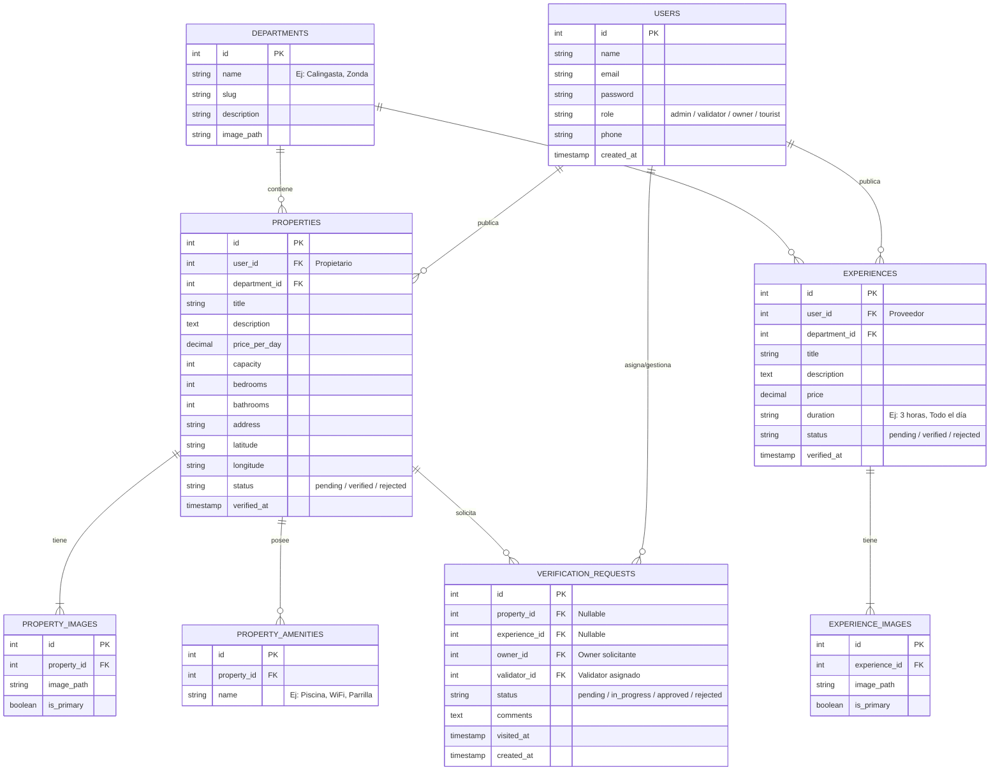

# Arquitectura Tecnológica: Turismo Seguro San Juan

## 1. Stack Tecnológico de la Plataforma
Para lograr un desarrollo rápido, robusto, fácil de desplegar y libre de problemas de CORS o autenticación cruzada, se adopta un **enfoque monolítico**:

- **Backend**: **Laravel 11** (PHP 8.2+). Provee la estructura MVC, seguridad, ORM (Eloquent), migraciones y el motor de plantillas (Blade) o API integrada.
- **Base de Datos**: **SQLite**. Ideal para la fase actual del proyecto; autotenida, veloz y sin requerimientos de servidores de base de datos complejos.
- **Frontend**: **TypeScript + Tailwind CSS** compilados dinámicamente mediante **Vite** (integrado nativamente en Laravel).
- **Enfoque de Integración**:
  - Para interactuar dinámicamente en el front sin la complejidad de React/Vue (si se quiere mantener simpleza monolítica extrema), usaremos **Laravel Blade Components + Alpine.js + TypeScript** (para tipar scripts de lógica interactiva).
  - *Alternativa recomendada para alta interacción*: **Laravel + Inertia.js + React/TypeScript**. Esto permite escribir componentes de React con TypeScript del lado del frontend y manejarlos desde controladores de Laravel, manteniendo el monolito (cero CORS, enrutamiento unificado). *En esta documentación nos enfocaremos en la integración nativa de Vite con Blade y scripts TypeScript estructurados para migrar los archivos HTML legacy directamente a vistas dinámicas Blade.*

---

## 2. Estructura de la Base de Datos (SQLite Schema)

El modelo de datos se implementará mediante migraciones de Laravel. A continuación se detalla el diseño de las tablas principales:



---

## 3. Estructura de Directorios del Proyecto Monolítico
Al unificar el backend y el frontend, el proyecto seguirá la estructura estándar de Laravel 11 potenciado con TypeScript y Tailwind:

```text
ts_turismoseguro/
├── app/
│   ├── Http/
│   │   ├── Controllers/
│   │   │   ├── HomeController.php          # Renderiza la Home con destacados
│   │   │   ├── RentalController.php        # Catálogo y detalle de alquileres
│   │   │   ├── ExperienceController.php    # Catálogo y detalle de experiencias
│   │   │   └── VerificationController.php  # Solicitud de validación
│   │   └── Middleware/
│   └── Models/                             # Eloquent Models (Property, Experience, etc.)
├── bootstrap/
├── config/
├── database/
│   ├── database.sqlite                     # Archivo de base de datos local
│   ├── migrations/                         # Estructura del esquema
│   └── seeders/                            # Carga de datos iniciales basados en la legacy DB
├── resources/
│   ├── css/
│   │   └── app.css                         # Punto de entrada de Tailwind CSS
│   ├── js/
│   │   ├── app.ts                          # Punto de entrada de TypeScript
│   │   ├── components/                     # Controladores JS/TS interactivos
│   │   │   ├── filter-system.ts            # Lógica de filtrado cliente-servidor
│   │   │   ├── gallery.ts                  # Carruseles y visualizadores de imágenes
│   │   │   └── contact.ts                  # Integración de APIs de WhatsApp/Llamadas
│   │   └── types/                          # Interfaces de TypeScript
│   └── views/                              # Vistas y layouts de Blade
│       ├── layouts/
│       │   └── app.blade.php               # Layout base (Navbar + Footer compartidos)
│       ├── components/                     # Componentes Blade reutilizables
│       │   ├── navbar.blade.php
│       │   ├── footer.blade.php
│       │   ├── rental-card.blade.php       # Tarjeta de alquiler (antes repetida)
│       │   ├── experience-card.blade.php   # Tarjeta de experiencia
│       │   └── validation-badge.blade.php  # Sello "Verificado TS"
│       ├── home.blade.php                  # index.html legacy
│       ├── rentals/
│       │   ├── index.blade.php             # alquileres.html legacy
│       │   └── show.blade.php              # detalle-alquiler.html legacy
│       └── experiences/
│           ├── index.blade.php             # experiencias-listado.html legacy
│           └── show.blade.php              # detalle-experiencia.html legacy
├── routes/
│   └── web.php                             # Rutas web del monolito (sin CORS)
├── vite.config.js                          # Configuración de compilación TS/Tailwind
└── package.json                            # Dependencias front (Tailwind, Autoprefixer, TS)
```

---

## 4. Estrategia de Componentización (Evitar Código Repetitivo)
El análisis del código legacy demuestra una fuerte duplicidad en HTML y CSS. Para resolver esto:

1. **Layout Centralizado (`layouts/app.blade.php`)**:
   - Contendrá el `<head>`, la inclusión de fuentes de Google Fonts, Font Awesome, y los assets compilados por Vite (`@vite(['resources/css/app.css', 'resources/js/app.ts'])`).
   - Alojará el `navbar` y el `footer` en un único lugar. Cada página inyectará su contenido dinámico dentro de una directiva `@yield('content')` o slot.

2. **Componentes Blade Reutilizables**:
   - **`components/rental-card`**: Recibe un objeto de tipo `Property` y renderiza la tarjeta estandarizada. Evita tener que copiar y pegar el HTML de las tarjetas en la Home y en el listado de alquileres.
   - **`components/experience-card`**: Recibe un objeto `Experience` y renderiza su tarjeta respectiva.
   - **`components/validation-badge`**: Sello verde "Verificado TS". Cambia de estilo de acuerdo al nivel o fecha de verificación si fuera necesario.

3. **Controladores TypeScript Compartidos**:
   - En lugar de tener archivos JS separados por página que replican la lectura de parámetros URL (`alquileres.js`, `detalle-alquiler.js`), se crearán módulos en `resources/js/components/` que se importan y ejecutan selectivamente según los elementos presentes en el DOM.

---

## 5. Plan de Migración de Legacy a Monolito
Para realizar la transición de manera limpia y sin perder la lógica existente:
1. **Inicialización**: Instalar Laravel 11, configurar `DB_CONNECTION=sqlite` y crear el archivo `database/database.sqlite`.
2. **Modelado y Migraciones**: Crear las migraciones para todas las tablas detalladas en el esquema de BD.
3. **Poblar la BD (Seeders)**: Escribir seeders en Laravel que tomen los objetos mock que existen actualmente en `legacy/detalle-alquiler.js` (`alquileresDB`) y `legacy/detalle-experiencia.js` (`experienciasDB`) e inserten esos registros en la base de datos SQLite para tener contenido inicial real.
4. **Instalación de Frontend**: Configurar Tailwind CSS, TypeScript y sus dependencias en `package.json`. Configurar `vite.config.js`.
5. **Creación del Layout y Componentes**: Cortar el navbar y footer de `legacy/index.html` e integrarlos en `resources/views/layouts/app.blade.php`.
6. **Migración de Vistas**:
   - Convertir `index.html` a `home.blade.php`.
   - Convertir `alquileres.html` a `rentals/index.blade.php` sustituyendo las tarjetas estáticas por un bucle `@foreach($properties as $property)` que invoque al componente `<x-rental-card :property="$property" />`.
   - Convertir `detalle-alquiler.html` a `rentals/show.blade.php` cargando los datos desde el controlador en base al ID de la ruta.
   - Hacer lo mismo para experiencias.
7. **Lógica de Filtros**: Adaptar la lógica de filtros de JS a consultas dinámicas de base de datos mediante Eloquent (filtros en el backend), lo que permite paginación real, búsquedas más rápidas y datos consistentes.
